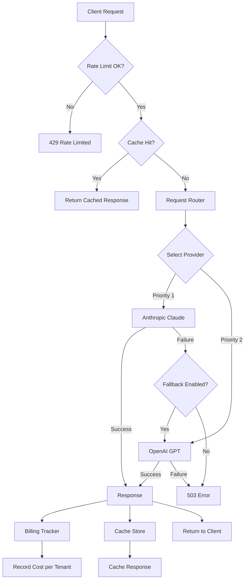

# AI GenAI AI Gateway

Multi-provider AI Gateway with intelligent routing, automatic fallback, response caching, per-tenant rate limiting, and cost tracking.

## Objectives

- Understand the AI gateway pattern as an abstraction layer that decouples application code from specific LLM providers
- Implement priority-based request routing with health-aware provider selection across multiple LLM backends
- Design automatic failover and fallback strategies to ensure high availability when a primary model provider is unavailable
- Build sliding-window rate limiting on a per-tenant basis to protect upstream APIs and enforce usage quotas
- Apply response caching with TTL and LRU eviction to reduce latency and cost for repeated prompts
- Architect a multi-tenant billing and cost-attribution system that tracks token usage per model and per customer
- Create unified provider adapters that normalize heterogeneous API contracts (Anthropic, OpenAI) behind a common interface
- Structure a production-grade FastAPI service with layered middleware for observability, validation, and error handling
- Containerize and orchestrate the gateway using Docker Compose for local development and deployment readiness
- Write integration and unit tests for asynchronous Python services using pytest-asyncio and dependency injection

## Table of Contents
1. [Overview](#overview)
2. [Project Structure](#project-structure)
3. [Deployment](#deployment)
4. [API Reference](#api-reference)
5. [Testing](#testing)

---

## End-to-End Flow



---

## Overview

| Component | Description |
|-----------|-------------|
| Request Router | Priority-based provider selection with health-aware fallback |
| Rate Limiter | Sliding window per-tenant RPM limiting |
| Response Cache | LRU cache with TTL for identical prompts |
| Billing Tracker | Per-tenant, per-model cost attribution |
| Provider Adapters | Anthropic + OpenAI with health checks |

---

## Project Structure

```
ai-genai-ai-gateway/
├── src/ai_gateway/
│   ├── providers/          # Anthropic + OpenAI adapters
│   ├── routing/router.py   # Priority routing with fallback
│   ├── ratelimit/limiter.py # Sliding window rate limiter
│   ├── cache/store.py      # LRU response cache with TTL
│   ├── billing/tracker.py  # Cost tracking per tenant
│   ├── api/router.py
│   └── main.py
├── tests/
├── config/
├── pyproject.toml, Dockerfile, docker-compose.yml
```

---

## Deployment

```bash
poetry install && cp .env.example .env
poetry run python -m uvicorn ai_gateway.main:app --reload --port 8000
poetry run pytest
docker-compose up --build
```

---

## API Reference

| Endpoint | Description |
|----------|-------------|
| POST /api/v1/gateway/generate | Generate LLM response via gateway |
| GET /api/v1/gateway/health | Provider health status |
| GET /api/v1/gateway/ratelimit/{tenant_id} | Rate limit usage |
| GET /api/v1/gateway/cache/stats | Cache hit/miss stats |
| POST /api/v1/gateway/cache/clear | Clear cache |
| GET /api/v1/gateway/billing/{tenant_id} | Tenant billing report |

---

## Testing

```bash
poetry run pytest --cov=src/ai_gateway --cov-report=term-missing
```
